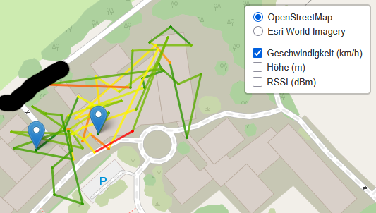

# EdgeTX GPS Visualizer

Visualize GPS flight paths from EdgeTX telemetry logs on interactive maps with customizable data overlays.

**🚀 Try it now:** [https://hnz101.github.io/loganalyzer_pyodide.html](https://hnz101.github.io/loganalyzer_pyodide.html)

## Features

- Interactive flight path visualization on OpenStreetMap or satellite view
- Color-coded overlays for speed, altitude, or RSSI signal strength
- 100% browser-based processing - your data never leaves your device
- Export maps as HTML files for offline viewing

## Usage

1. Open the [web app](https://hnz101.github.io/loganalyzer_pyodide.html)
2. Upload your EdgeTX CSV telemetry log
3. Select Generate Interactive Map
4. View and download your flight map

## Components

- **`loganalyzer.py`** - Python component for CSV processing and map generation
- **`loganalyzer_pyodide.html`** - HTML5 interface using Pyodide

## Development Notes

This project was developed with significant AI assistance, as Python, JavaScript, and HTML5 are not my daily programming languages. Most of the code was generated and refined with the help of AI tools.

**Contributions welcome!** If you find bugs or have suggestions for improvements, please feel free to:
- Open an issue to report problems
- Submit pull requests with fixes or enhancements
- Share feedback on the user experience

As this is an AI-assisted project, there may be edge cases or bugs that haven't been discovered yet.